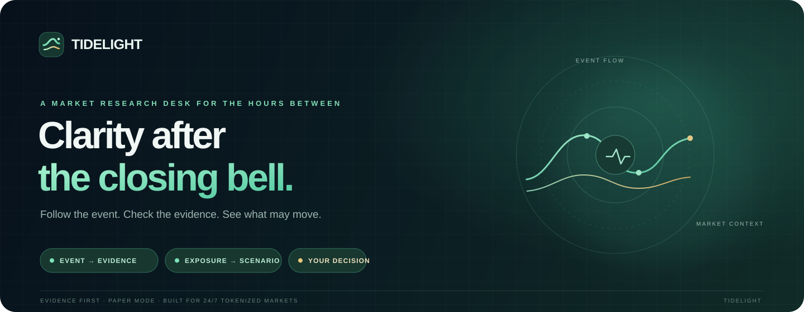

<div align="center">
  
  <br />
  <a href="https://tidelight-two.vercel.app/"><strong>Open Tidelight ↗</strong></a>
  &nbsp; · &nbsp;
  <a href="https://tidelight-two.vercel.app/markets">Explore the live market map</a>
  &nbsp; · &nbsp;
  <a href="https://tidelight-two.vercel.app/research">Start a research brief</a>
</div>

<br />

<div align="center">


</div>

# Meet Tidelight

### A clearer view of the stories moving tokenized markets.

Markets do not pause when the closing bell rings. A company announcement, a policy change, or a surprise in another sector can ripple through tokenized shares while the usual headlines are quiet.

**Tidelight helps you follow that ripple.** Ask a question in everyday language. Bring the original source. See what it says, what might disagree, which assets could be exposed, and what would change the picture.

> **The idea in one line:** Event → Evidence → Exposure → Scenario → Decision.

Tidelight is a research companion. It helps organize information so people can make their own decisions; it does not tell anyone what to buy or sell.

---

## Your first look

No installation or trading account needed. [Open the public app](https://tidelight-two.vercel.app/) and explore the market map.

| If you want to… | Go here |
| --- | --- |
| Browse market assets and their latest public quotes | [Markets](https://tidelight-two.vercel.app/markets) |
| Turn a question and a source into a cited research brief | [Research desk](https://tidelight-two.vercel.app/research) |
| Keep track of assets you care about | [Watchlist](https://tidelight-two.vercel.app/watchlist) |
| Explore a historical strategy replay | [Strategy Lab](https://tidelight-two.vercel.app/strategies) |
| See how the paper-only market watcher works | [Nightwatch](https://tidelight-two.vercel.app/nightwatch) |

Some personal features ask you to sign in so your saved work stays with your account.

## Two ways to use one desk

### Mini — a simple answer, with its receipts

Start with a question, choose a company, and read a plain-language summary. Open the supporting evidence and the conditions that could change the conclusion. You do not need to understand trading terminology to follow the story.

### Pro — the details behind the story

Inspect evidence cards, source dates, claim confidence, counter-evidence, market exposure, catalysts, invalidation conditions, and scenario notes. Pro is for people who want to examine the reasoning step by step.

Both views share the same research trail. A simpler screen does not mean a less careful answer.

## What makes Tidelight different?

Most market screens begin and end with a price. Tidelight is designed to connect the *reason a story matters* to the evidence for it and the assets it may touch.

1. **Event** — frame the news or question you are investigating.
2. **Evidence** — attach a source and see claims tied back to its supplied text.
3. **Exposure** — map the story to relevant issuers, sectors, and tokenized assets.
4. **Scenario** — lay out what could happen, including opposing evidence and what would invalidate the view.
5. **Decision** — keep a transparent research record for your own judgment.

The goal is not a confident-sounding prediction. It is a more inspectable path from a story to a considered decision.

## What you can explore today

- **Live market map.** Public Bitget spot-market quotes, asset details, token classifications, quote freshness, and candle history where available. Prices and availability can change, and some tokenized assets may have limited history or market hours.
- **Source-based research.** Mini can read a supported HTTPS link from the selected company, SEC.gov, or a selected public publisher. Pro can compare up to five excerpts you provide. Tidelight checks every shown quote against the captured text and shows the source link and limits.
- **Exposure mapping.** Connect a research event to relevant companies, sectors, and tokenized-market instruments, then inspect possible catalysts and risks.
- **Strategy Lab.** Replay a clearly labeled baseline against historical public candles. Review costs, trade records, test windows, and saved runs. [See the latest five-market test](./docs/STRATEGY_VALIDATION_2026-10-05.md): in that 30-day snapshot, the baseline trailed buy-and-hold on every market. We show that plainly; a historical replay is an experiment, not a forecast.
- **Nightwatch.** Start a paper check against public Bitget market data, review simulated positions, and follow each decision. Active paper workspaces can also receive a daily in-app summary. Market checks remain user-triggered; nothing places a live order.
- **Your private workspace.** Sign in to save briefs, watchlists, strategy runs, and account preferences. Row-level access rules scope private records to their owner.
- **A desk that feels like yours.** Choose among three visual themes and use the compact mobile navigation on a phone.

## A few important boundaries

| Tidelight does | Tidelight does not |
| --- | --- |
| Show public market data with source and freshness context | Promise that every market or quote is available at all times |
| Help organize user-provided source material into reviewable research | Independently verify every statement in an external article |
| Run historical and paper simulations with visible assumptions | Guarantee a strategy will work in the future |
| Keep Nightwatch in paper mode | Place live exchange orders or manage customer funds |

**Please treat every brief and simulation as informational research, not financial advice or a recommendation.** Always check original sources and your own local rules before acting on market information.

## Privacy & account safety

- Private briefs, watchlists, and saved runs are associated with your signed-in account and protected by database access policies.
- Tidelight's market pages use public market endpoints. A Bitget trading key is not required to browse them.
- Nightwatch currently simulates activity. The app does not enable live order execution.
- Mini reads only allowlisted public-source hosts, caps fetched pages at 2 MB, and rejects redirects to unapproved hosts. Pro stores only the excerpts you submit with their source links.
- An authenticator app can be enrolled for extra verification. Passkey enrollment and sign-in are implemented against Supabase Auth’s experimental WebAuthn support, but stay hidden until the provider and relying-party domain are configured for the production site.
- Qwen credentials are configured on the server and should never be placed in a public repository or browser code.

## For the curious (and the people building with us)

If technical setup is not your thing, you can stop here and enjoy the app. If you would like to help improve it, this section is for you.

### The building blocks

| Part | What it does |
| --- | --- |
| Next.js and TypeScript | The pages and server-side application logic |
| Supabase | Sign-in, PostgreSQL storage, and owner-scoped database policies |
| Bitget public market API | Public tickers, instrument details, and historical candles |
| Bitget Qwen gateway | Source-bounded research synthesis, called only from the server |
| Vercel | Application hosting and production deployments |

### Run a local copy

You will need Node.js, npm, and access to the Tidelight Supabase project. From this folder:

```bash
npm ci
cp .env.example .env.local
```

Add your Supabase project URL and publishable key to `.env.local`. To use Bitget Qwen synthesis locally, set these server-side variables:

```dotenv
BITGET_QWEN_API_KEY=your-active-Bitget-Qwen-key
BITGET_QWEN_BASE_URL=https://hackathon.bitgetops.com/v1
BITGET_QWEN_MODEL=qwen3.8-max
```

The app appends `/chat/completions` to the base URL, so keep the value ending at `/v1`. Use the same variable names in Vercel Project Settings → Environment Variables. Keep `.env.local` private; do not commit it or paste secrets into issues.

Then start the development server:

```bash
npm run dev
```

Open [http://localhost:3000](http://localhost:3000). Helpful checks before sharing a change:

```bash
npm run typecheck
npm run lint
npm run build
```

Database changes live in [`supabase/migrations`](./supabase/migrations). They use Supabase row-level security so each signed-in person can access only their own private records.

## What we are building toward

The next steps are broader source coverage and independent publisher verification, source discovery beyond a link you provide, longer rolling market histories, a scheduled paper-check observation period, and final account-security verification. Passkeys and leaked-password protection still depend on completing Supabase Auth settings. Live exchange orders stay disabled. Our product thesis and current milestone notes are in the [product plan](./PROJECT_PLAN.md) and the [hackathon plan](./docs/HACKATHON_PRODUCT_PLAN.md).

We are building carefully: show the evidence, label assumptions, preserve uncertainty, and keep simulated results visibly simulated.

## Come build a calmer market desk with us

Try the [live app](https://tidelight-two.vercel.app/), explore the [market map](https://tidelight-two.vercel.app/markets), or open an issue with a confusing moment, a missing source, or an idea that would make the product more useful.

<div align="center">
  <br />
  <strong>Read the story. Check the evidence. Keep your bearings.</strong>
  <br /><br />
  <sub>Made for the hours between headlines. · Tidelight</sub>
</div>
